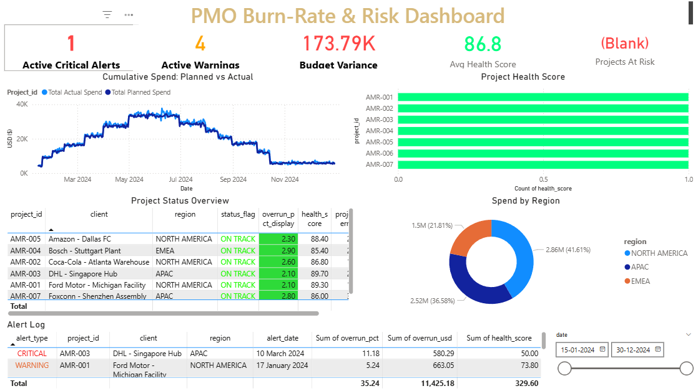

# PMO Burn Risk Tracker

Tracks budget burn rates across hardware deployment projects and alerts when projects go over budget. Built as a portfolio project for a robotics deployment PMO use case (Botsync, Singapore-based AMR company).

## The Problem

Hardware deployment PMOs running 5+ concurrent AMR rollouts spend hours every week manually aggregating cost data from spreadsheets. By the time they spot an overrun, it's already happened. This automates the tracking.

## How It Works

Three Python scripts that run in sequence:

```
generate_data  -->  raw CSV (with nulls, spikes, delays)
pipeline       -->  clean CSV (filled, capped, enriched)
alerts         -->  burn-rate calc + alert log + Power BI exports
```

Then import the CSVs into Power BI for dashboards.

## Project Structure

```
PMO Burn Risk/
  scripts/
    generate_data.py      # Phase 1: simulates 7 projects of daily telemetry
    pipeline.py           # Phase 2: cleans, normalizes, validates
    alerts.py             # Phase 3: burn-rate math, alert engine, exports
  data/
    raw_telemetry.csv     # dirty output from phase 1
    clean_telemetry.csv   # processed master from phase 2
  output/
    fact_daily_telemetry.csv     # Power BI fact table
    dim_alert_log.csv            # alert events
    kpi_executive_summary.csv    # one row per project
  run_all.py              # runs all 3 phases
  POWERBI_SETUP.md        # Power BI dashboard instructions
  README.md
```

## Quick Start

```
pip install pandas numpy
python run_all.py
```

That's it. No external APIs, no cloud setup.

Or run phases individually:
```
python scripts/generate_data.py
python scripts/pipeline.py
python scripts/alerts.py
```

## What Each Phase Does

### Phase 1 - Data Simulation

Generates ~1400 rows of daily telemetry for 7 concurrent deployments across 3 regions (APAC, EMEA, North America). Each project has a client, fleet size, duration, and daily budget. The data includes:

- Random nulls (~4% of rows) to simulate missing daily reports
- Supply-chain spike events (15-45% cost surges on random days)
- Shipping delays (3-14 days during procurement)

Projects range from an 8-unit Coca-Cola warehouse rollout to a 30-unit Amazon fulfillment center.

### Phase 2 - Processing Pipeline

Reads the raw CSV, fills nulls with project-median values, caps statistical outliers (>3 sigma), normalizes text, enriches with derived columns (month, week, timeline %), and validates with assertions. Outputs a clean master dataset.

### Phase 3 - Burn Rate Engine + Alerts

Calculates burn rate per row:
- `burn_rate = cumulative_actual / cumulative_planned`
- Overrun = burn_rate - 1.0
- CRITICAL alert: overrun > 10%
- WARNING alert: overrun > 5%

Projects final spend via linear extrapolation: `cumulative_actual / pct_timeline_elapsed`

Health score (0-100):
- Starts at 100
- -5 points per 1% over budget (max -50)
- -3 points per shipping delay day (max -30)
- Minimum floor at 0

Exports three CSVs for Power BI import.

## Sample Alert Output

```
CRITICAL - AMR-003 (DHL - Singapore Hub)
    Region    : APAC
    Date      : 2024-06-15
    Status    : Site Installation
    Burn Rate : 11.2% over budget
    Overrun   : $580
    Projected : $131,663 total overrun at completion
    Health    : 66.5/100
  >> Escalate to PMO Director + Finance Lead
```

## Dashboard Preview 


## Power BI Dashboard

See POWERBI_SETUP.md for instructions on building:
- Gantt chart of deployment timelines
- Burn rate line chart (planned vs actual)
- KPI cards (active alerts, budget variance, avg health)
- Status matrix with conditional formatting

Dark-mode theme included.

## Tech Stack

- Python 3.10+, pandas, numpy
- Power BI Desktop (for visualization)
- CSV for data exchange

## What This Is Missing

If I were to keep building this:
- Email/Slack notifications (currently just prints to terminal)
- Live database connector instead of static CSVs
- Unit tests
- a CLI for overriding thresholds without editing code
- A config file for project definitions and thresholds

Pull requests welcome.

## Note

This project uses entirely simulated data. No real client information is represented.
